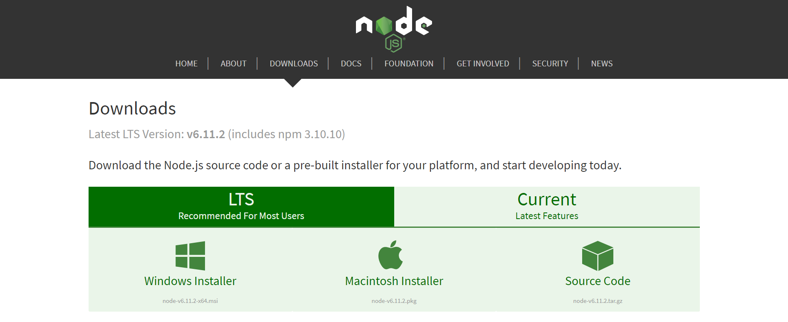

# Citrual_App
A Coding Challenge for Cirtual

<h1>! Make Sure your Interent is working for this 
App to work becuase it makes use of the CDNs from the internet and also the Database is hosted on mLab</h1>

<h3>This is built using MEAN stack, Node and Express for server side scripting, 
AngularJS 1.6.4 for Front End and MongoDB hosted on mLab for the back end database </h3>

<h3>TO DO's before you start</h3>

<ul>
    <li>Make sure your internet is working</li>
    <li>Install Node onto your system and NPM comes with it</li>
</ul>

Let's get started....

<ol>
    <li><h4>Clone the repo and open the project folder</h4></li>
    <li><h4>Open your Command Prompt and use it to navigate to the project folder</h4></li>
    <li>
        <h4>First thing to do is run the command "npm install" to install all the dependancies, you do not need to run this command because I downloaded all the dependancies into the node_modules folder, but I'd suggest to do it since it is safer to know everything is installed perfectly.</h4>
    </li>
    <li><h4>Now that you have installed all the dependencies, it is time to run the application, stay in the project folder on your command prompt and type "node server" and that should start your server on port 4001</h4></li>
</ol>
